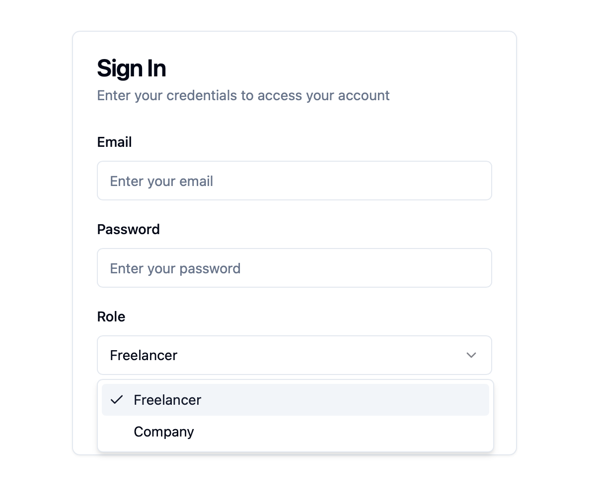
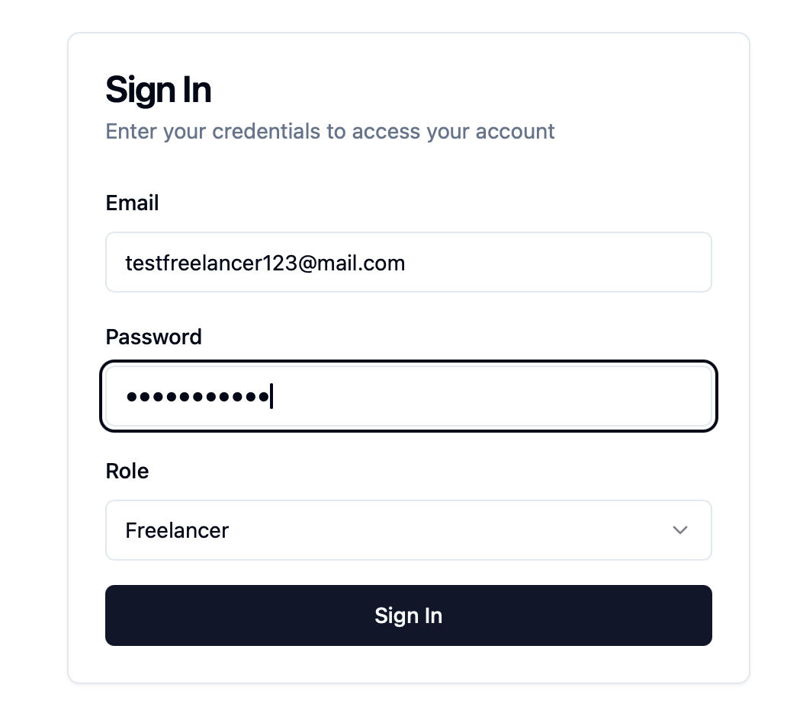
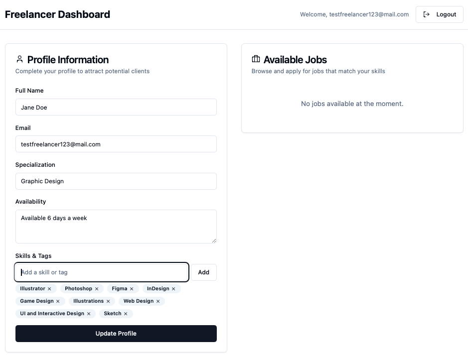
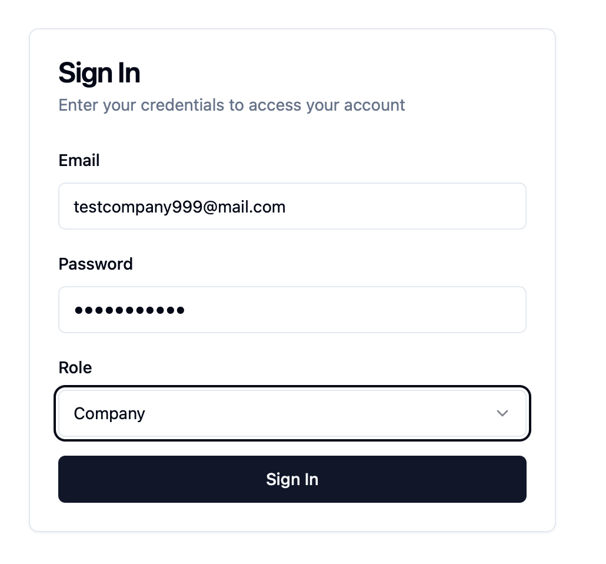
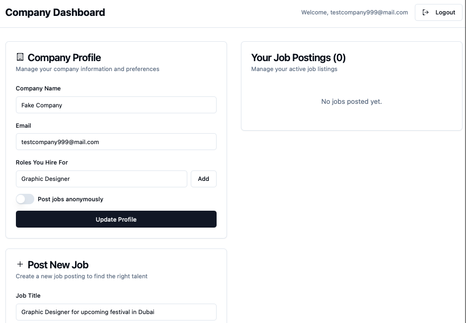
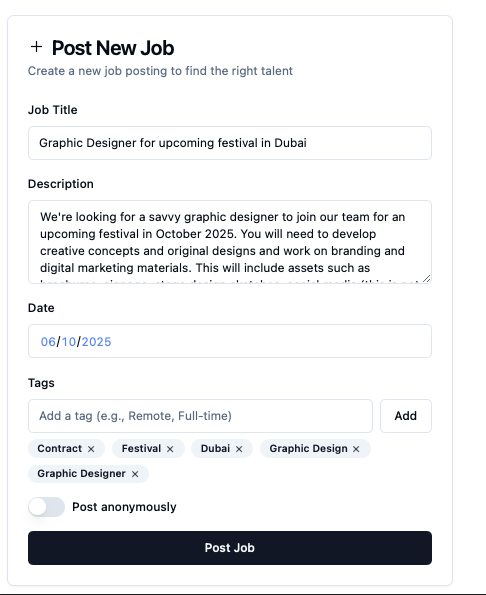
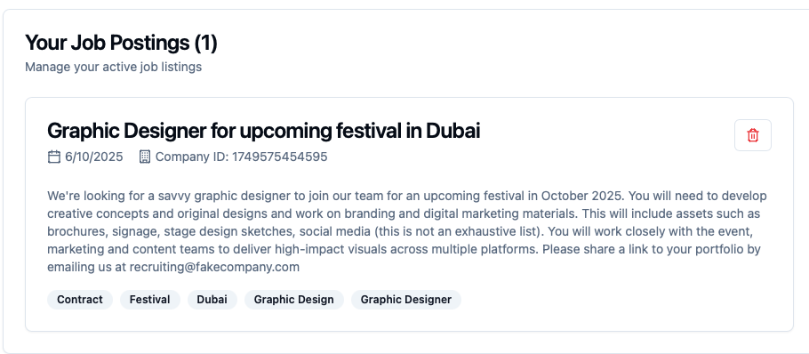
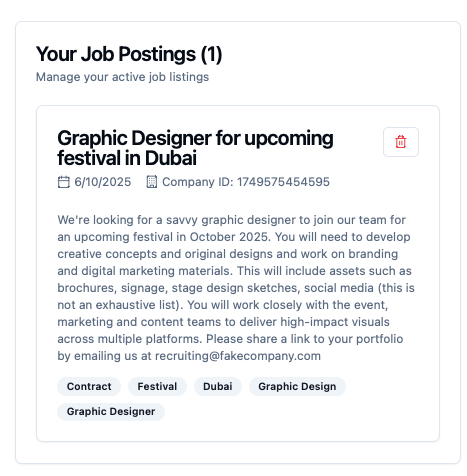

# crewcallpro-mvp
No-code MVP for Crew Call Pro – a talent marketplace connecting freelance event professionals with hiring companies in the GCC.

# Crew Call Pro – MVP Prototype

**Crew Call Pro** is a mobile-first talent marketplace connecting freelance event professionals (like AV techs, makeup artists, photographers, and more) with hiring companies across the GCC.

This is a no-code MVP prototype built using [Lovable.dev](https://www.lovable.dev), designed for early validation and testing.

---

## 🔗 Live Prototype

👉 [View the live MVP on Lovable](https://your-lovable-url.lovable.dev)  
_(Replace this with your actual URL)_

---

## 🧱 Features

- Two user roles: **Freelancer** and **Company**
- Authentication (mock) with role-based dashboards
- Freelancer dashboard: profile setup and job browser
- Company dashboard: post jobs (including anonymous mode)
- Tag-based filtering system
- No sensitive data collection (no EID)
- Built for early testing and waitlist onboarding only

---

## 🧪 Security Disclaimer

⚠️ This MVP uses mock authentication and browser-based local storage.  
It is not secure and not intended for production or real user data.  
Future versions will integrate a secure backend (e.g. Supabase).

---

## 📸 Screenshots

Screenshots of the MVP in progress can be found in the `/assets` folder.

---

## 👩‍💻 Tech Stack

- [Lovable.dev](https://www.lovable.dev)
- Google Forms (for waitlist intake)
- GitHub (project documentation)
- Carrd (public landing page at [crewcallpro.com](https://www.crewcallpro.com))

---

## 🚀 Status

This is an active MVP under development as part of the AI App Challenge.  
We're testing with early users and building fast!

## 🔍 Screenshots

### 🔐 Main Sign In

### 👤 Freelancer Login

### 👩‍🎤 Freelancer Dashboard

### 🧑‍💼 Company Login

### 🏢 Company Dashboard

### ✍️ Job Post Form

### ✅ Job Posted (Version A)

### ✅ Job Posted (Alternate View)

